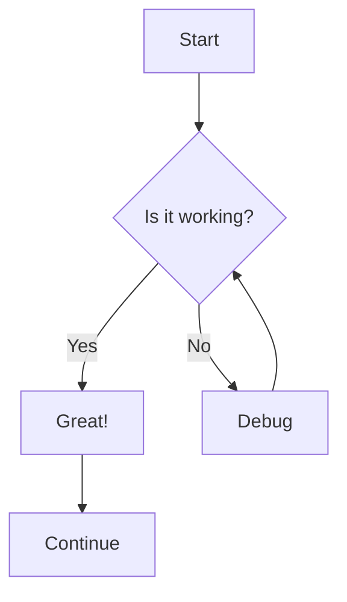
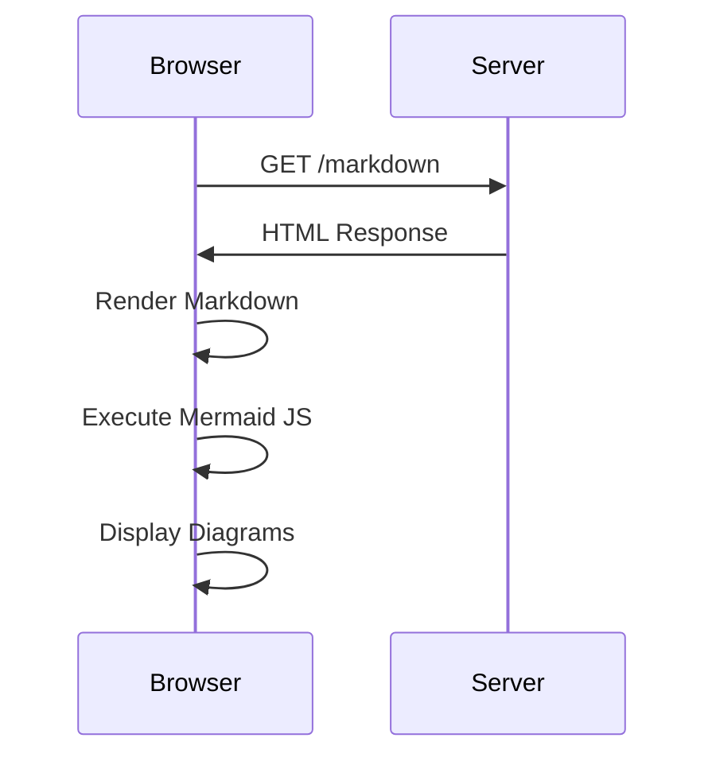
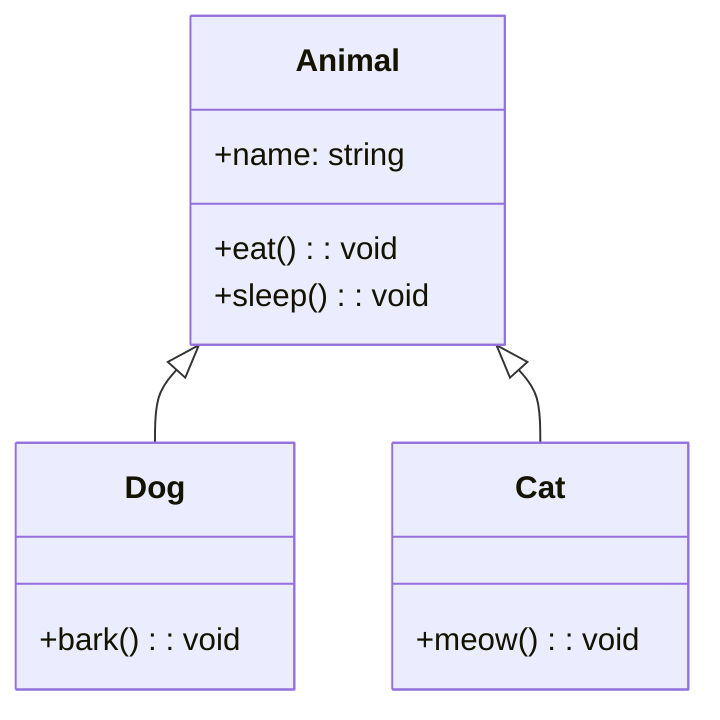

# Markdown

Hello, I am an example **Markdown** (`*.md`) file!

## Table Example

| Name        | Language            | Purpose                     |
|-----------: | ------------------- | --------------------------- |
| Rust        | Systems Programming | Fast, memory-safe applications |
| Python      | Scripting           | Rapid development, data science |
| JavaScript  | Web                 | Frontend/backend web development |
| Go          | Systems             | Cloud-native services       |

## Mermaid Diagram

## Sequence Diagram

## Class Diagram

