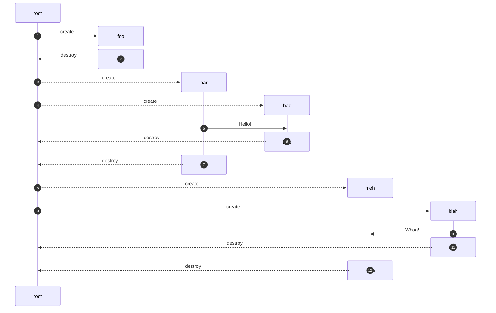

```mermaid
sequenceDiagram
    create participant I0 as root
    autonumber
    create participant I1 as foo
    I0-->>I1: create
    destroy I1
    I1-->>I0: destroy
    create participant I2 as bar
    I0-->>I2: create
    create participant I3 as baz
    I0-->>I3: create
    I2->>I3: Hello!
    destroy I3
    I3-->>I0: destroy
    destroy I2
    I2-->>I0: destroy
    create participant I4 as meh
    I0-->>I4: create
    create participant I5 as blah
    I0-->>I5: create
    I5->>I4: Whoa!
    destroy I5
    I5-->>I0: destroy
    destroy I4
    I4-->>I0: destroy

```
