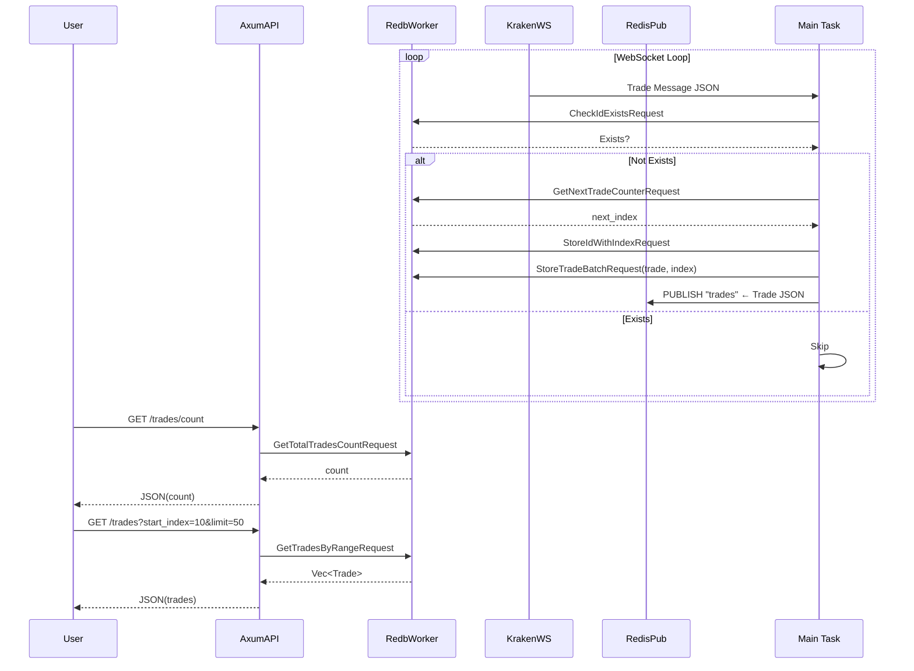
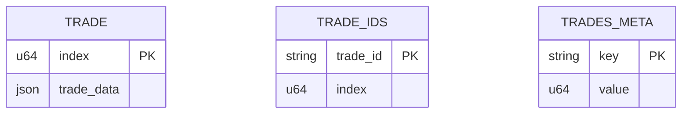

NOTE(dkorolev): This commit is ChatGPT-generated!

And here is how the output of the autogenerated HTML from this directory looks like!


System flor diagram (ChatGPT):



Storage schema diagram (ChatGPT):



# 🧪 WebSocket-Based Real-Time Numerical Feeds for Stats & Visualization

## 📌 Chat 1: Finding Real-Time Public Data Feeds

> *Goal:* Discover public WebSocket-based feeds suitable for live statistics (e.g., sliding windows, prices/volume analytics).

### 📈 Crypto Exchanges

Most crypto exchanges offer free WebSocket APIs:
- **Binance**
  - ✅ Trades, order books, candlesticks
  - 🔗 [Docs](https://binance-docs.github.io/apidocs/spot/en/#websocket-market-streams)
- **Coinbase**
  - ✅ Live trades, order books
  - 🔗 [Docs](https://docs.cloud.coinbase.com/exchange/docs/websocket-overview)
- **Kraken**
  - ✅ Trades, order books
  - 🔗 [Docs](https://docs.kraken.com/websockets/)
- **Bitfinex**
  - ✅ Trades, books, candles
  - 🔗 [Docs](https://docs.bitfinex.com/docs/ws-general)
- **Bybit**
  - ✅ Derivatives, perpetual contracts
  - 🔗 Docs available on their site

### 💲 Stock Market (Limited Free Options)

- **Polygon.io**
  - ✅ Crypto: Free / Stocks: Paid
  - 🔗 [Docs](https://polygon.io/docs/crypto/get_v3_trades__cryptoticker__anchor)
- **IEX Cloud**
  - ✅ Free tier available for trades and quotes
  - 🔗 Docs on [iexcloud.io](https://iexcloud.io)

### 🌐 Other Real-Time Numerical Feeds

- **Met.no Weather API**
  - 🌧 Polling-based (simulate WebSocket)
- **OpenSky Network**
  - ✈️ Real-time air traffic
  - 🔗 [Docs](https://openskynetwork.github.io/opensky-api/)

---

## 🔥 Best Feeds for Sliding Window Stats

> Ideal for real-time analytics like:
- Last 30-second moving average
- 5-minute traded volume
- Rolling price volatility

✅ Crypto feeds are best due to:
- High frequency and volume
- WebSocket-first design
- Pair-specific subscription support

---

## ⚡ Quick-Start Examples

### 🔶 Binance Mini-Ticker

Stream of real-time price/volume updates for **all** pairs.

```bash
npx wscat -c wss://stream.binance.com:9443/ws/!miniTicker@arr
```

Message example:
```json
[
  {
    "e": "24hrMiniTicker",
    "s": "BNBBTC",
    "c": "0.0025",
    "v": "10000",
    "q": "18"
  }
]
```

### 🟢 Coinbase BTC-USD Ticker

```bash
npx wscat -c wss://ws-feed.exchange.coinbase.com
```

Then paste:
```json
{
  "type": "subscribe",
  "channels": [{ "name": "ticker", "product_ids": ["BTC-USD"] }]
}
```

---

## 🧪 One-liner Hack with `wscat`

```bash
(sleep 3; echo '{"type":"subscribe","channels":[{"name":"ticker","product_ids":["BTC-USD"]}]}'; sleep 10) | npx wscat -c wss://ws-feed.exchange.coinbase.com | tail -n +1 -f
```

✅ Clean and useful for scripting + piping into analysis tools.

---

## 💻 HTML5 + JavaScript WebSocket Viewer

### 📄 `btc-price.html`

```html
<!DOCTYPE html>
<html>
<head><meta charset="utf-8"><title>BTC-USD Price</title></head>
<body>
  <h1 id="price">Connecting...</h1>
  <script>
    const ws = new WebSocket("wss://ws-feed.exchange.coinbase.com");
    ws.addEventListener("open", () => {
      ws.send(JSON.stringify({
        type: "subscribe",
        channels: [{ name: "ticker", product_ids: ["BTC-USD"] }]
      }));
    });
    ws.addEventListener("message", (event) => {
      const data = JSON.parse(event.data);
      if (data.type === "ticker" && data.product_id === "BTC-USD") {
        document.getElementById("price").textContent = `$${data.price}`;
      }
    });
  </script>
</body>
</html>
```

---

## 📊 Clean HTML Table View (Kraken)

```html
<!DOCTYPE html>
<html>
<head>
  <meta charset="utf-8">
  <title>XBT/USD Trades</title>
  <style>
    body { font-family: sans-serif; background: #fafafa; padding: 20px; }
    table { width: 100%; border-collapse: collapse; table-layout: fixed; background: white; font-size: 1.5em; }
    th, td { padding: 8px 12px; border: 1px solid #ddd; text-align: right; }
    th { background: #f0f0f0; }
    .buy { color: green; } .sell { color: red; }
  </style>
</head>
<body>
  <table>
    <thead><tr><th>Price</th><th>Volume</th><th>Total</th></tr></thead>
    <tbody id="trades"></tbody>
  </table>
  <script>
    const ws = new WebSocket("wss://ws.kraken.com/");
    ws.addEventListener("open", () => {
      ws.send(JSON.stringify({
        event: "subscribe",
        pair: ["XBT/USD"],
        subscription: { name: "trade" }
      }));
    });
    ws.addEventListener("message", (event) => {
      const data = JSON.parse(event.data);
      if (Array.isArray(data) && data[2] === "trade" && data[3] === "XBT/USD") {
        const latest = data[1].at(-1);
        const price = parseFloat(latest[0]);
        const volume = parseFloat(latest[1]);
        const side = latest[3];
        const total = (price * volume).toFixed(2);
        document.getElementById("trades").innerHTML = `
          <tr>
            <td class="${side === "b" ? "buy" : "sell"}">$${price.toFixed(2)}</td>
            <td>${volume.toFixed(6)}</td>
            <td>$${total}</td>
          </tr>`;
      }
    });
  </script>
</body>
</html>
```

---

## 🧠 Want More?

- ✅ Show 10–20 most recent trades?
- ✅ Add rolling stats overlay?
- ✅ Export CSVs or draw real-time charts?

Let me know and I’ll add a live chart or stat overlay next! 🎯
